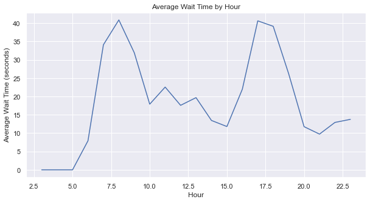
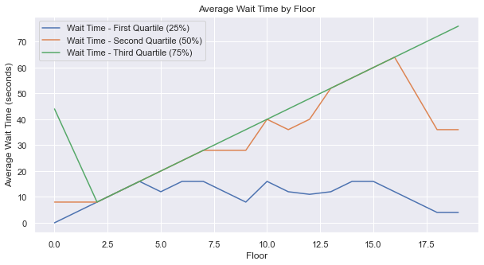
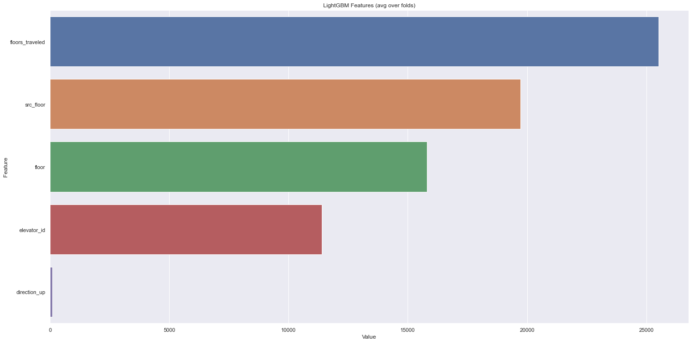

# Elevator-Optimising-Using-Machine-Learning
Project developed for NTU DeepLearning Hackathon

## 1. Problem Statement and Aim
Today, more and more IoT devices are already changing every aspect of life, and elevators as an important part of life are no exception. For example, KONE uses the Watson IoT Platform running on IBM Cloud to collect streams of incoming data about movement, vibration, loading, and other information.

However, we've noticed that despite more and more elevator companies concerned about how their elevator's functionality, not all of their products are running with IoT devices embedded. 

Therefore, we want to provide a solution that can be retrofitted to any existing elevator and provide companies with a range of data about user experience and elevator performance through data processing and Machine Learning.

## 2. Problem Elaboration
Every modern elevator will record these information during its runtime: Action (door open, door close), direction(up, down, idle), current floor, etc.. These raw data simply record the status of the elevator, they record every event, but they are not used for otimizing the elevator performance. 

Our algorithm should use data processing and ML techniques to transform these raw data into something that's related to user experience. For example, wait time. We've drawn 3 sub-problems from this demand:

1. Is wait time related to time of the day?
2. Is wait time related to which floor user is on?
3. What factor affects wait time the most?

With these subproblems answered, one would be in a good place to improve the elevator's scheduling algorithm. And that is our ultimate goal. Unnfortunitely, due to limited time in this 3-day Hackerthon,we don't have enough time and resources to keep fine-tuning a machine learning-based elevator scheduling algorithm to beat traditional elevator algorithms.

## 3. Exploratory Data Analysis
The dataset is collected from 4 different elevators in an office building in New York City. The original raw data is as follows

Through forward-search and backward-search in the time-series, we observe the action taken by the elevator, i.e. door opening and closing, to determine user in-and-out. Then, cross-referencing with system time, we could transform the raw data to something like this.

## Subproblem 1: Is wait time related to time of the day?

## Subproblem 2: Is wait time related to which floor user is on?

## Subproblem 3: What factor affects wait time the most?
To answer this question, we use Light-GBM model with RandomSearchCV for hyperparameter tuning.
The best estimator across all searched parameters are:
>LGBMClassifier(lambda_l1=1, lambda_l2=1, min_data_in_leaf=50, num_leaves=127,reg_alpha=0.1)

The output of feature importance is as follows:

## Future Exploration and Development Directions
We aim to improve elevator operation efficieny using Machine Learning Algorithms.

The idea is to build a prediction model that calculates the likelyhood of requests in every time instant. To do that, we created an elevator class to simulate a single elevator environment. We also built a random-request generator that would create realistic requests for the elevator. The generator will consider the trends we discovered from EDA.

Our goal is to implement the algorithm and compare it with the SCAN Disk distribution algorithm which is commonly used for elevator services. 

The comparison will be of 2 aspects: user experience(wait time), and elevator wear(determined by distance moved)
However, due to limited time and resources in this 3-day Hackathon, we didn't managed to fine tune the model.

It will be of our future research direction for this project.
